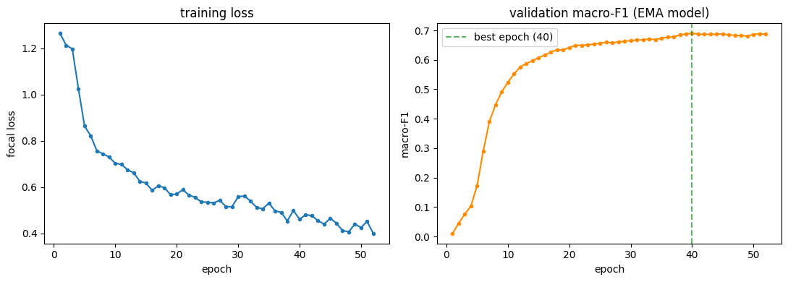
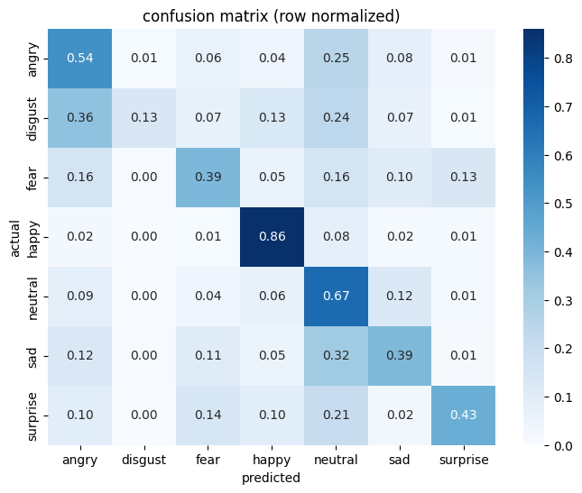

# 😊 Facial Emotion Recognition using Transfer Learning (ResNet18)

> A deep learning-based facial emotion recognition system built on the FER2013 dataset using **Transfer Learning, Focal Loss, MixUp, EMA, Test-Time Augmentation, and Grad-CAM**.


---

# 📖 Overview

Facial expressions are one of the most informative non-verbal communication channels. This project develops a facial emotion recognition (FER) system capable of classifying facial expressions from the FER2013 dataset using a transfer learning pipeline based on **ResNet18**.

Instead of relying on a conventional CNN, this implementation incorporates modern deep learning techniques to improve robustness, generalization, and interpretability.

---

# ✨ Features

- ImageNet-pretrained ResNet18
- Transfer Learning
- Focal Loss
- Weighted Random Sampling
- MixUp Regularization
- Exponential Moving Average (EMA)
- Test-Time Augmentation (TTA)
- Grad-CAM Visualization
- Webcam Emotion Recognition
- Exploratory Behavioral Analysis (Research Demonstration)

---

# 🎯 Problem Statement

Facial emotion recognition systems often struggle with:

- Class imbalance
- Limited datasets
- Overfitting
- Poor model interpretability

This project addresses these challenges using a transfer-learning pipeline combined with advanced regularization and explainable AI techniques.

---

# 📂 Dataset

**FER2013**

- 7 emotion classes
- Grayscale facial images
- Resized to 224 × 224
- Converted to RGB for transfer learning

Emotion Categories:

- Angry
- Disgust
- Fear
- Happy
- Sad
- Surprise
- Neutral

---

# 🛠 Tech Stack

- Python
- PyTorch
- Torchvision
- OpenCV
- NumPy
- Pandas
- Matplotlib
- Scikit-learn
- Grad-CAM

---

# 🏗 Model Architecture

The model uses a pretrained **ResNet18** backbone initialized with ImageNet weights.

Pipeline:

FER2013 Image

↓

Resize (224×224)

↓

Normalization

↓

ResNet18 Feature Extractor

↓

Fully Connected Layer

↓

Softmax

↓

Emotion Prediction

---

# 🚀 Training Strategy

The model incorporates multiple techniques to improve performance:

✅ Transfer Learning

✅ Weighted Random Sampler

✅ Focal Loss

✅ MixUp Data Augmentation

✅ Exponential Moving Average (EMA)

✅ Test-Time Augmentation (TTA)

These strategies improve convergence and help mitigate the class imbalance present in FER2013.

---

# 📊 Results

| Metric | Score |
|--------|-------|
| Best Validation Macro-F1 | **0.6898** |
| Test Accuracy | **55.02%** |
| Test Macro-F1 | **0.4904** |

---

# 📈 Training Curves



---

# 🔥 Grad-CAM Visualization

Grad-CAM is used to visualize the image regions that contribute most to the model's prediction, improving interpretability and trustworthiness.

---

# 🎥 Webcam Demonstration

The notebook includes real-time webcam inference using OpenCV for live emotion recognition.

---

# 📊 Confusion Matrix



---

# 🧪 Exploratory Behavioral Analysis

As a research demonstration, the notebook computes exploratory affective indices such as:

- Prediction confidence
- Entropy
- Runner-up confidence
- Temporal trends

> **Note:** These indicators are exploratory and **must not** be interpreted as clinical or diagnostic measures.

---

# ⚙ Installation

Clone the repository

```bash
git clone https://github.com/yourusername/emotion-recognition-resnet18.git
```

Install dependencies

```bash
pip install -r requirements.txt
```

Launch the notebook

```bash
jupyter notebook notebook_3.ipynb
```

---

# 📂 Repository Structure

```
README.md
notebook_3.ipynb
requirements.txt
images/
checkpoints/
results/
```

---

# 🎯 Applications

- Human–Computer Interaction (HCI)
- Affective Computing
- Emotion-Aware Interfaces
- Healthcare Research
- Driver Monitoring Systems
- Educational Technologies
- Human-Robot Interaction

---

# 🔮 Future Work

- Vision Transformer (ViT) models
- Mobile deployment
- Video-based temporal emotion recognition
- Multimodal emotion recognition
- Larger FER datasets
- Cross-domain evaluation

---

## 📜 License

This repository is **All Rights Reserved**.

The code and accompanying materials are shared only to showcase my work. Reproduction, redistribution, modification, or use in academic or commercial projects without explicit written permission is prohibited.

---

# 👩‍💻 Author

**Titiksha Yadav**

Electronics Engineering Undergraduate

Human-Computer Interaction Researcher
